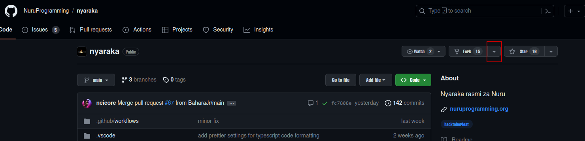
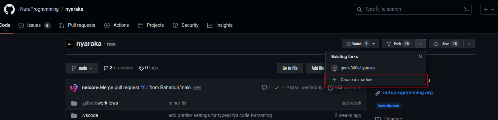
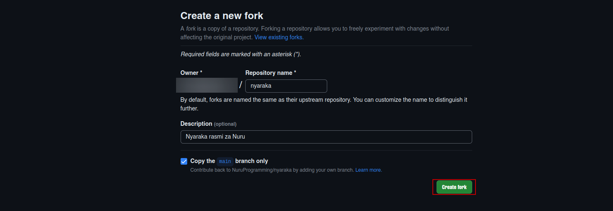
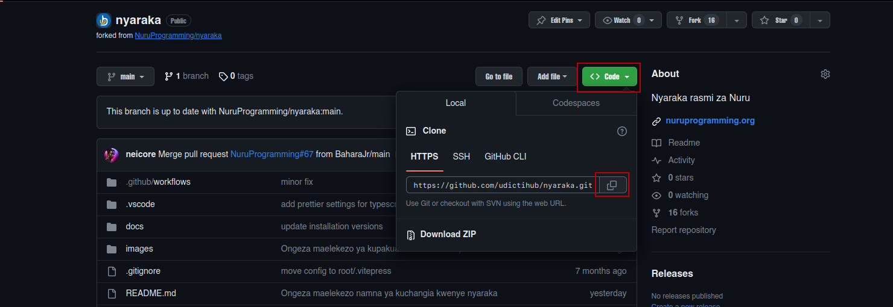

## Mambo 👋🏽!

## Karibu kwenye Muongozo wa Kuchangia kwenye Nyaraka za NURU.

Waweza kuwa mpya au una uelewa mdogo jinsi ya kuchangia kwenye mradi huu wa **NURU** lugha ya kwanza kutengeneza programu za kompyuta / tarakilishi kwa kiswahili. Karibu tukuwezeshe kuchangia na kuongeza thamani kwenye mradi huu .

# MUONGOZO YA KUCHANGIA

Wachangiaji wanahimizwa kufuata miongozo hii wanapochangia:

- Nakili hazina (Fork the repository) [Jinsi ya kunakili hazina](https://docs.github.com/en/get-started/quickstart/fork-a-repo)

_Fuata haya maelekezo kwenye hizi picha mnato(screenshots)_







- Baada ya kuunda nakala ya hazina , kwenye akaunti yako ya GitHub , inabidi uweke hazina hio kwenye kompyuta yako ( locally ). Bonyeza kwenye kitufe `code` , utapata nafasi ya kuchagua jinsi , kama wewe ni mtumiaji wa `LINUX na unatumia VS Code`, utatumia terminal , kwa hio utabonyeza kitufe cha pili. Angalia picha ifuatayo



- Kinachofuata utabonyeza `Ctrl + Alt + T`
- Kwenye Terminal yako , utafanya haya

```bash
git clone <link ya ulichokopi>
cd nyaraka
code .
```

- Unda tawi (branch) kwa mchango wako.

```bash
git checkout -b <tawi-lako>
```

- Kuweza kuchangia kwenye nyaraka inabidi uwe una fahamu Markdown. Jifunze Hapa [Kujifunza Markdown](https://www.markdownguide.org/cheat-sheet/)
- Fanya mabadiliko , alafu

```bash
git add <file name> .
git commit -m " kwa ufupi taarifa ya mabadiliko"
git push origin <tawi-lako>
```

- Alafu , Tuma ombi la kuchukuliwa (pull request) kwa ukaguzi, hakikisha ombi lako linapita vipimo vyote.

## Kielelezo cha Maelezo ya Ombi la Kuchukuliwa (Markdown)

Maelezo ya ombi lako la kuchukuliwa (PR) yanapaswa kuwa na vichwa vifuatavyo na maudhui yanayolingana kwa muundo wa Markdown.

- Kichwa cha PR ( Ombi Vutwa ) , Elezea kwa ufupi na kinagaubaga
- Mwili wa PR (Ombi Vutwa) , Elezea Kiundani ulichofanya , ushahidi wa picha mnato (screen shots) , au tovuti (links)

# Viwango vya Kodi na Mazoea Bora ya Mradi

## Jedwali la Yaliyomo

1. [Muundo wa Mradi](#muundo-wa-mradi)
2. [Makubaliano ya Kutaja Majina ya Faili](#makubaliano-ya-kutaja-majina-ya-faili)
3. [Uumbaji wa Nambari](#uumbaji-wa-nambari)
4. [Kupambana na Kosa](#kupambana-na-kosa)
5. [Usimamizi wa Tegemezi](#usimamizi-wa-tegemezi)
6. [Udhibiti wa Mtindo](#udhibiti-wa-mtindo)

---

### 1. Muundo wa Mradi

- Panga faili na saraka za mradi kwa mantiki. Muundo wa kawaida ni pamoja na kuweka vipengele, kurasa, mali, na kazi za utumiaji katika saraka tofauti.

```
.
├── docs
│   └── src
│       ├── buliani.md
│       ├── en
│       │   ├── buliani.md
│       │   ├── fibonacci.md
│       │   ├── index.md
│       │   ├── ingizo-la-mtumiaji.md
│       │   ├── kama.md
│       │   ├── kamusi.md
│       │   ├── kanuni-za-upangaji.md
│       │   ├── kwa.md
│       │   ├── maneno-tengwa.md
│       │   ├── maoni.md
│       │   ├── nambari.md
│       │   ├── safu.md
│       │   ├── suluhisho-sudoku.md
│       │   ├── swichi.md
│       │   ├── tungo.md
│       │   ├── tupu.md
│       │   ├── ufungaji-android.md
│       │   ├── ufungaji-linux.md
│       │   ├── ufungaji-macos.md
│       │   ├── ufungaji-windows.md
│       │   ├── viendeshaji.md
│       │   ├── vilivyojengwa-ndani.md
│       │   ├── vitambulisho.md
│       │   ├── vitendakazi.md
│       │   └── wakati.md
│       ├── fibonacci.md
│       ├── index.md
│       ├── ingizo-la-mtumiaji.md
│       ├── kama.md
│       ├── kamusi.md
│       ├── kanuni-za-upangaji.md
│       ├── kwa.md
│       ├── maneno-tengwa.md
│       ├── maoni.md
│       ├── mfano.md
│       ├── nambari.md
│       ├── safu.md
│       ├── suluhisho-sudoku.md
│       ├── swichi.md
│       ├── tungo.md
│       ├── tupu.md
│       ├── ufungaji-android.md
│       ├── ufungaji-linux.md
│       ├── ufungaji-macos.md
│       ├── ufungaji-windows.md
│       ├── viendeshaji.md
│       ├── vilivyojengwa-ndani.md
│       ├── vitambulisho.md
│       ├── vitendakazi.md
│       └── wakati.md
├── images
│   └── gh.png
├── CONTRIBUTING.md
├── package.json
├── package-lock.json
├── README.md
└── vercel.json
```

### 2. Makubaliano ya Kutaja Majina ya Faili

- Tumia PascalCase kwa majina ya faili za vipengele (kwa mfano, `Kipengele.md`)

### 3. Mpangilio wa Kodi (Codes)

- Tumia Prettier kudumisha mpangilio wa kodi ulio sawa katika mradi. Weka na tekeleza sheria za uumbaji katika faili ya `.prettierrc`.

### 4. Kupambana na Kosa

- Tumia ESLint kwa uchambuzi wa kodi(codes) wa msimbo wa tuli ili kugundua masuala yanayoweza kutokea na kutekeleza viwango vya uandishi wa kodi(codes). Sanidi sheria za ESLint kulingana na mahitaji ya mradi.

### 5. Usimamizi wa Tegemezi

- Weka tegemezi zako hadi sasa. Tumia meneja wa paketi (npm). Fanya ukaguzi wa tegemezi na sasisha ili kurekebisha mapengo ya usalama wa mradi , yaani ziwe za sasa na sio maktaba za zamani.

### 6. Udhibiti wa Mtindo

- Fuata mazoea ya udhibiti wa mtindo, haswa unapotumia Markdown. Andika kwa usanifu wa kawaida kama inavyohitajika.

Ikiwa una maswali au unahitaji ufafanuzi kuhusu miongozo yoyote hii, tafadhali wasiliana na viongozi wa mradi au watunzaji.

Heri ya kazi!
