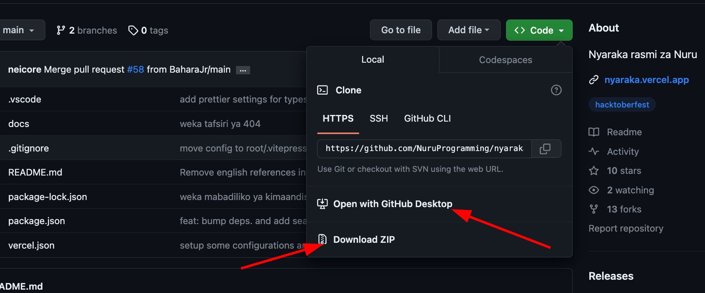

# Nyaraka rasmi za Nuru

Hii ni hazina inayobeba nyaraka rasmi za Nuru.

## Kupakua hazina hii

Hili upakue hazina hii, kwenye tamino ya tarakilishi(kompyuta) yako, fuata maelekezo yafuatayo.

1. Kama unatumia SSH

```bash
git clone git@github.com:NuruProgramming/nyaraka.git
```

2. Kama hutumii SSH

```bash
git clone https://github.com/NuruProgramming/nyaraka.git
```

Vile vile unaweza kupakua moja kwa moja kutoka [GitHub](https://github.com/NuruProgramming/nyaraka) kwa kutumia vitufe kama ilivyo kwenye picha hapa chini.



## Kufungua na kuanzisha

Kuweza kuifungua katika tarakilishi(kompyuta) yako, hakikisa umesanikisha `Node.js v16+`. Katika tamino yako tumia maelekezo yafuatayo ambayo yatasakinisha vitegemezi vya hazina hii;

```bash
npm i
```

Ikishamaliza kusanikisha, tumia maelekezo yafuatayo kuanzisha hazina hii iliuweze kuifungua kwenye kivinjari chako.

```bash
npm run docs:dev
```

## Kuchangia

Ili kuchangia katika hizi nyaraka, tengeneza tengeneza tawi (fork) katika akaunti yako na fuata maelekezo ya kupakua hapo juu.

Ongeza mabadiliko yako, thibitisha (commit) na itume (push) kwenye [GitHub](https://github.com).

```bash
git add -am "Tafsiri Nyaraka kwa kibena"
```

```bash
git push -u origin <TAWI LAKO>
```

Fungua Ombi la Kukubaliwa (Pull Request) kwenda kwenye nyaraka rasmi za [Nuru](https://github.com/NuruProgramming/nyaraka)

Unaweza pia kuchangia kwa kuongeza, kuboresha au kusahihisha matatizo katika sehemu ya matatizo [(issues)](https://github.com/NuruProgramming/nyaraka/issues).
